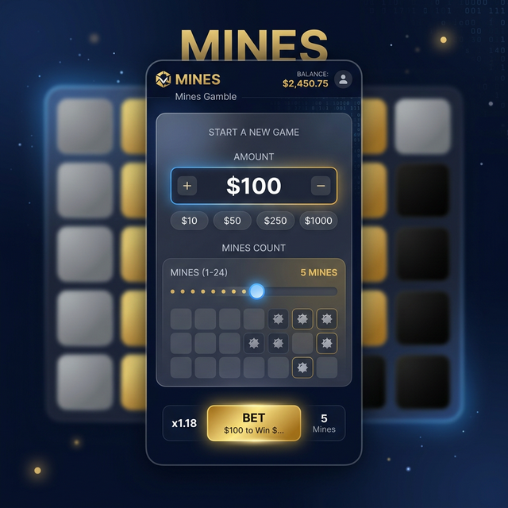
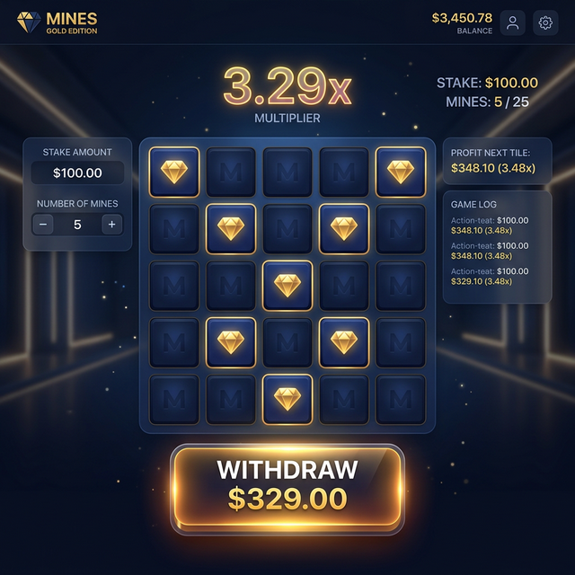
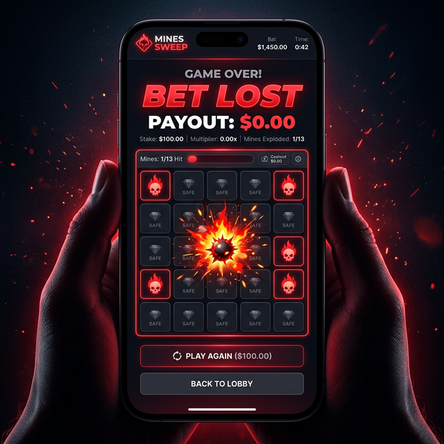
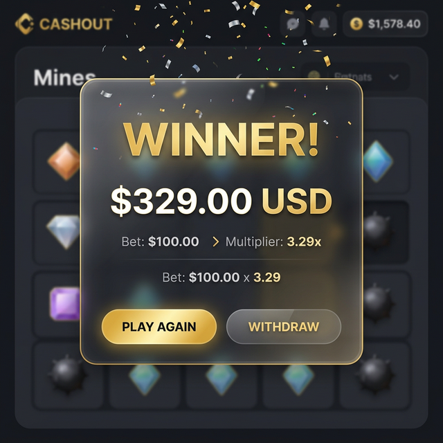

# 踩地雷遊戲 UI 原型 (Mockups) 展示

本文件展示了踩地雷遊戲的 4 個關鍵 UI 狀態原型。這些設計採用深色模式、玻璃擬物化 (Glassmorphism) 風格，旨在提供高端、現代化的遊戲體驗。

## 1. 遊戲啟動畫面 (Start Screen)
玩家在此畫面設置下注金額與地雷數量。設計突出了核心控制項與簡潔的 5x5 網格背景。

---

## 2. 遊戲進行中 - 精確倍數 (Playing State)
展示打開 5 格安全格子後的狀態。根據 RTP 96% 的對照表，目前的倍率顯示為精確的 **3.29x**。下方的「WITHDRAW」按鈕清楚標示可兌現的金額。

---

## 3. 踩中地雷畫面 - 押金沒收 (Game Over - Bet Forfeited)
修正後的畫面明確強調了 **「BET LOST」**。此畫面顯示 **「PAYOUT: $0.00」**，清楚傳達一旦踩中地雷，所有下注金額與累積獎金皆被沒收。

---

## 4. 結算畫面 - 獎金計算 (Cashout Success)
展示玩家主動兌現後的結果。畫面呈現了獎金的計算邏輯：`$100.00 (押注) x 3.29 (倍率) = $329.00 USD`。

