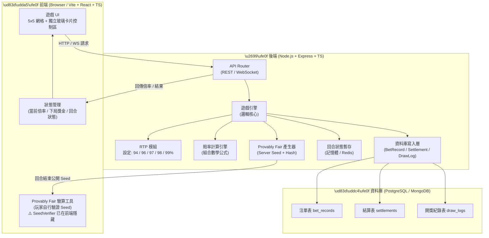
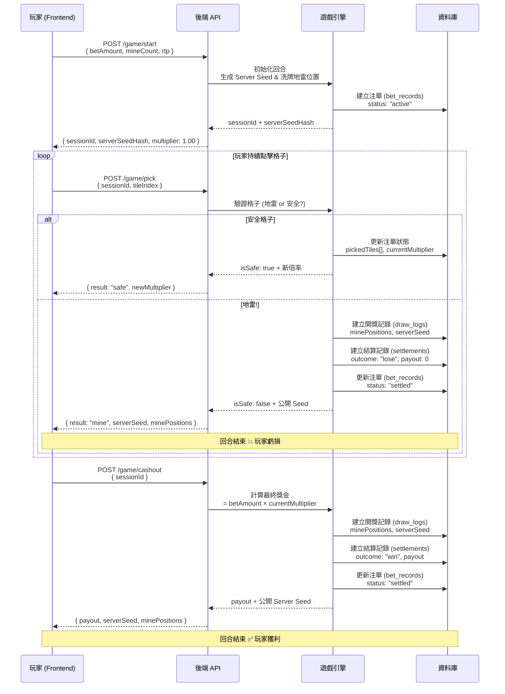

# Super Mines (超級踩地雷) - 專案提案書 (Proposal)

## 1. 專案背景與目標
本專案旨在使用現代化的前後端技術（Vite + React & Node.js），開發一款極致高質感 (Premium Casino) 加密貨幣風格「踩地雷」機率遊戲。
此遊戲的特色為**高透明度 (Provably Fair)**，並支援**單一網址整合 (http://localhost:3001/mine-game/)** 與 **行動端 PWA (/m/)**。

## 2. 遊戲核心規則
- **網格範圍**：5x5 網格（共 25 個格子）。
- **難度自訂**：玩家於單局開始前，可選擇 1 到 24 顆地雷隱藏於網格中。
- **遊玩流程**：
  - **終止與結算條件**：
  1. **兌現 (Cashout)**：玩家可隨時點擊「兌現」按鈕，以目前的獎金倍數結算。結算獎金 = `下注金額 × 目前倍率`。
  2. **完全過關 (Full Clear)**：若玩家成功揭開所有非地雷格子，系統將自動以最終最高倍數進行結算。
  3. **踩中地雷 (Hit a Mine)**：遊戲立即結束，**下注金額全數沒收**，獎金歸零。

## 3. 數學模型與機率模組 (RTP)
本專案系統後端內建**五段式設定的機率模組**。
系統將從設定檔讀取全域 RTP (Return to Player) 參數，確保精準控制莊家優勢 (House Edge)。 (前端介面預設隱藏此設定)

> **隱藏功能**：Provably Fair 驗算工具（SeedVerifier）已在前端隱藏，與 RTP Selector 採用相同處理方式（後端仍完整支援）。

- **支援的 RTP 設定值**：`94%`, `96%`, `97%`, `98%`, `99%`。

### 📊 賠率 (Multiplier) 計算公式
賠率的計算基於「組合數學 (Combinatorics)」。
- `n` = 總格子數 (25)
- `m` = 地雷數量 (1 ~ 24)
- `d` = 玩家已打開的安全格子數

**實際賠率公式**：
`Multiplier = (RTP / 100) * [ C(25, d) / C(25 - m, d) ]`

*(註：公式將計算至特定小數位數，並具備防止 JavaScript 浮點數誤差的處理機制)*

## 4. 系統技術架構 (Monorepo)
為了兼顧開發效率、部署便利性與安全性，專案劃分為以下兩個核心微服務：

### 4.1 前端 (Frontend)
負責與玩家互動、呈現細膩的視覺特效與順暢的操作回饋。
- **核心技術**：Vite + React + TypeScript
- **樣式與 UI**：TailwindCSS (用於快速建構響應式、玻璃擬物化 Glassmorphism 等 Premium UI 設計)。
- **職責**：5x5 遊戲網格渲染、難度切換、處理與後端的 WebSocket/HTTP API 通訊、動畫過場。
- **整合規格**：
  - **Base URL**：`/mine-game/`
  - **Mobile Route**：`/mine-game/m/` (強制載入 Mobile Pro UI)
  - **PWA**：支援 Manifest 定義與 Service Worker 緩存。

### 4.2 後端 (Backend)
負責處理機率、結算邏輯與公平性驗證（不信任任何前端帶來的遊戲狀態資料）。
- **核心技術**：Node.js (Express 或 Fastify) + TypeScript
- **職責**：
  - **Provably Fair 機制**：每局開場生成一組 `Server Seed`，在伺服器端洗牌地雷位置，僅傳送 Hash 給前端。遊戲結束時公開 Seed 供玩家驗算。
  - **RTP 引擎**：統一乘載 `94% ~ 99%` 機率運算的後端服務，負責結算贏得的獎金與倍率。
  - **狀態驗證**：防止玩家透過修改請求竄改點擊的格子或作弊。

## 5. 開發階段規劃
1. **Phase 1: 環境建置與核心演算法**
   - 初始化 GitHub Repository。
   - 建立 Vite + Node.js Monorepo 環境。
   - 完成 RTP 機率計算 Utils（涵蓋組合數學實作與單元測試）。
2. **Phase 2: 後端邏輯與公平機制**
   - 實作 Provably Fair (可證明公平) 的生成邏輯。
   - 建立遊戲流程的 API 端點 (Start, Pick, Cashout)。
3. **Phase 3: 前端實作與特效**
   - 建立支援 TailwindCSS 的高品質遊戲介面 (Premium UI)。
   - 串接後端 API，完成完整遊戲的 Lifecycle。
4. **Phase 4: 測試與優化**
   - E2E 流程驗證。
   - 在各 RTP 參數下進行大量自動化投注模擬，驗證最終的回報率是否精準貼合設定值。

---

## 6. 系統架構圖



---

## 7. 遊戲流程圖



---

## 7.1 資料庫 JSON 格式範例

### 📜 注單記錄 (bet_records)
当玩家下注後立即建立，狀態為 `active`；結算後更新為 `settled`。

```json
{
  "betId": "BET-20260310-A8F3C2",
  "sessionId": "SESS-xQz9kR2mL4",
  "playerId": "player_001",
  "betAmount": 100.00,
  "mineCount": 5,
  "rtpSetting": 96,
  "status": "settled",
  "pickedTiles": [3, 7, 14, 20],
  "currentMultiplier": 3.411,
  "serverSeedHash": "a3f9c1e2b84d...",
  "createdAt": "2026-03-10T12:00:00.000Z",
  "updatedAt": "2026-03-10T12:05:30.000Z"
}
```

### 🏆 結算記錄 (settlements)
回合結束後（無論是水雷、地雷或主動兑現）寫入此表。

```json
{
  "settlementId": "SET-20260310-B5D9E1",
  "betId": "BET-20260310-A8F3C2",
  "outcome": "win",
  "betAmount": 100.00,
  "finalMultiplier": 3.411,
  "payout": 341.10,
  "profit": 241.10,
  "settledAt": "2026-03-10T12:05:30.000Z"
}
```

### 🔍 開獎紀錄 (draw_logs)
保存此局配置，供玩家自行驗證 Provably Fair 公平性。

```json
{
  "drawId": "DRAW-20260310-C7A2F0",
  "betId": "BET-20260310-A8F3C2",
  "serverSeed": "e7d2a4f18bc3...",
  "serverSeedHash": "a3f9c1e2b84d...",
  "clientSeed": "player_nonce_42",
  "minePositions": [1, 9, 12, 18, 23],
  "totalTiles": 25,
  "mineCount": 5,
  "revealedAt": "2026-03-10T12:05:30.000Z"
}
```

---

## 8. RTP 賠率倍率對照表 (範例: 5 顆地雷)

> 以下為地雷數量 = 5 的情境，分別在不同 RTP 設定下打開 d 個安全格子後的累積倍率。

| 打開第幾格 (d) | 公平倍率 (100%) | RTP 99% | RTP 98% | RTP 97% | RTP 96% | RTP 94% |
|:---:|:---:|:---:|:---:|:---:|:---:|:---:|
| 1 | 1.250x | 1.238x | 1.225x | 1.213x | 1.200x | 1.175x |
| 2 | 1.579x | 1.563x | 1.547x | 1.531x | 1.516x | 1.484x |
| 3 | 2.018x | 1.997x | 1.977x | 1.957x | 1.937x | 1.896x |
| 4 | 2.611x | 2.585x | 2.559x | 2.532x | 2.506x | 2.454x |
| 5 | 3.427x | 3.393x | 3.358x | 3.324x | 3.290x | 3.221x |
| 6 | 4.569x | 4.523x | 4.478x | 4.432x | 4.386x | 4.295x |
| 7 | 6.201x | 6.139x | 6.077x | 6.015x | 5.953x | 5.829x |
| 8 | 8.586x | 8.500x | 8.414x | 8.328x | 8.242x | 8.071x |
| 9 | 12.163x | 12.042x | 11.920x | 11.798x | 11.677x | 11.434x |
| 10 | 17.692x | 17.515x | 17.338x | 17.161x | 16.984x | 16.630x |

---

## 9. v1.3 更新紀錄 (2026-03-16)

### 前端修正
1. **BetInput 步進值**：加減按鈕步進值改為 10。
2. **初始下注金額**：預設值改為 $100。
3. **Provably Fair (SeedVerifier)**：前端已隱藏，與 RTP Selector 採用相同處理方式（後端仍完整支援）。
4. **手機版佈局**：上下堆疊（遊戲板在上、控制面板在下），`@media (max-width: 768px)` 響應式切換。
5. **手機版 TileGrid**：移除 `aspect-square`，使用 `calc(100dvh - 440px)` 限制高度。
6. **手機版間距壓縮**：gap: 0, padding: 0 6px, control-card padding: 5px 10px。
7. **`.app__main` 手機版**：`flex: none` 消除空白。
8. **GameResultOverlay**：炸彈顯示 "$0.00" payout + "-$betAmount lost"。
9. **ActionButton**：遊戲結束後顯示 "PLAY AGAIN"。

### 後端修正
1. **DATABASE_URL**：使用獨立 `mines_game` 資料庫。

### PWA 通用修正
1. Viewport meta：`width=device-width, initial-scale=1.0, maximum-scale=1.0, user-scalable=no, viewport-fit=cover`。
2. 全域 CSS：`100vh` → `100dvh`，`-webkit-text-size-adjust: 100%`。
3. 手機版響應式斷點：`@media (max-width: 768px)`。

### Mockup 截圖
- 桌面版：`apps/mines-game/docs/mockups/desktop/mines_idle.png`
- 手機版：`apps/mines-game/docs/mockups/mobile/mines_idle_mobile.png`

---

*文件版本：v1.3 | 日期：2026-03-16*
